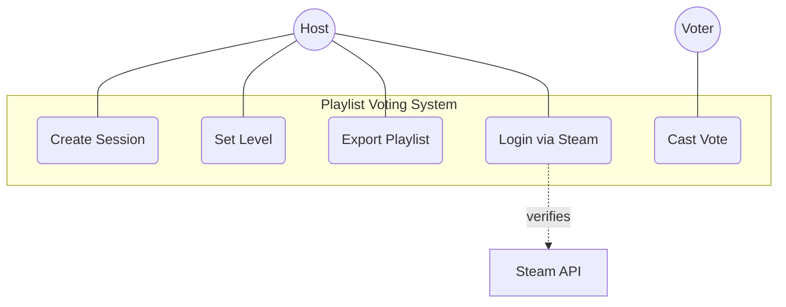
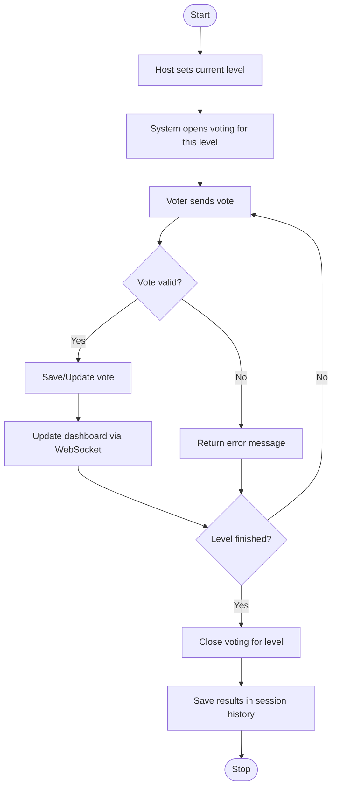

# Zeepkist Playlist Voting

This project allows Zeepkist players to create voting sessions for their playlists. Spectators (e.g., via Twitch or Steam) can vote on the levels currently being played.

## Features

- **Session Management**: Create, pause, and rename voting sessions.
- **Real-time Voting**: Support for various platforms (Steam, Twitch, etc.).
- **Playlist Generation**: Export voting results as a Zeepkist playlist file.
- **Dashboard**: Clear web interface for hosts and voters.

## Workflows

### Use Case Diagram

The following diagram shows the interactions of different actors with the system.



### Activity Diagram: Voting Process

This workflow describes how a level is set and votes are collected.



## Setup & Installation

### Prerequisites

- Java 21 or higher
- MongoDB (local or Atlas)
- Steam API Key (for authentication)

### Starting the Application

1. Clone the repository.
2. Configure `application.properties` (MongoDB URI, Steam API Key).
3. Start the application via Gradle:
   ```bash
   ./gradlew bootRun
   ```

## API Documentation

Interactive API documentation (Swagger UI) is available after startup at:
`http://localhost:8080/swagger-ui/index.html`

## WebSocket Endpoints

In addition to REST endpoints, the system supports WebSockets for real-time updates.

- **Topic**: `/topic/timer` - Receives timer updates from the host.
- **Mapping**: `/app/timer` - Host sends timer status to the server.

## License

[Insert license here, if applicable]
